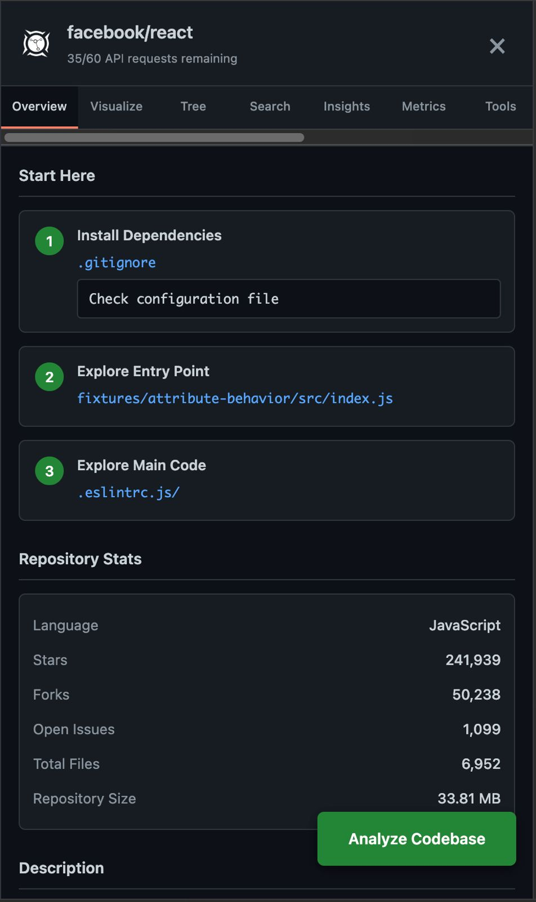
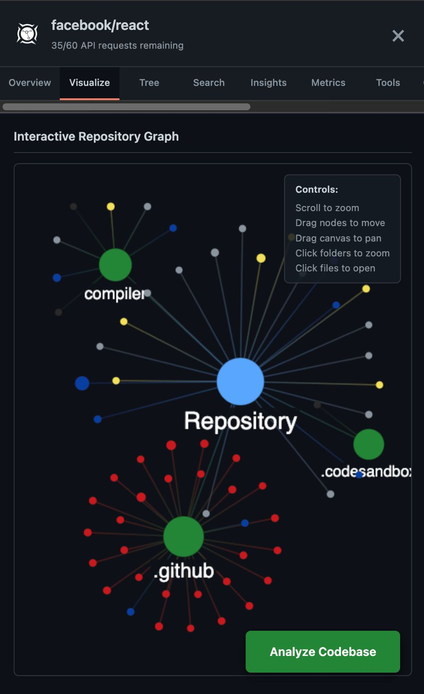
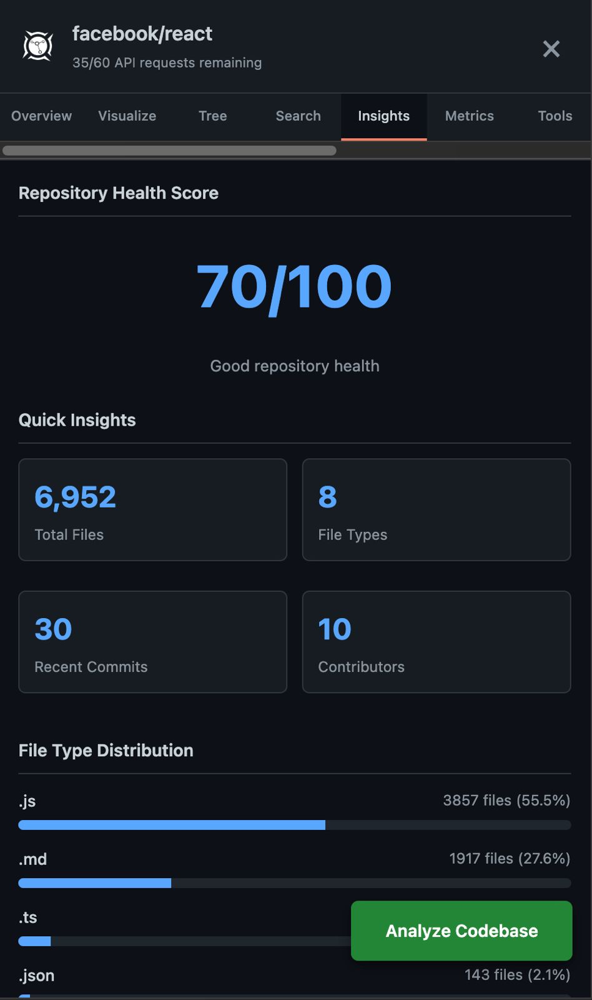
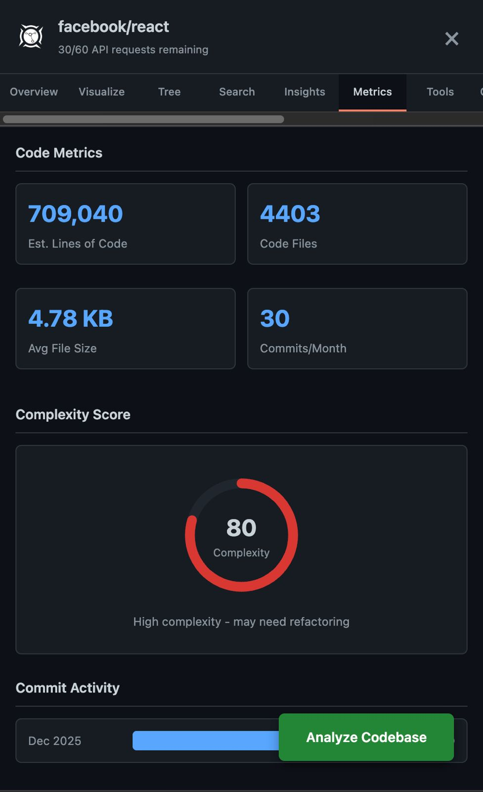
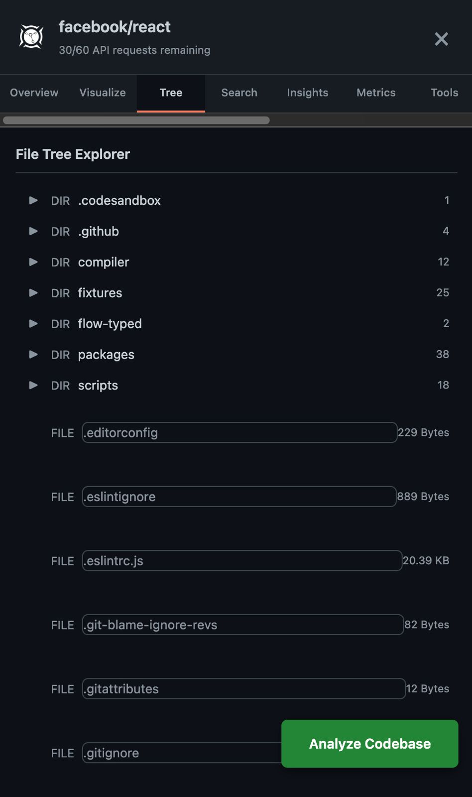
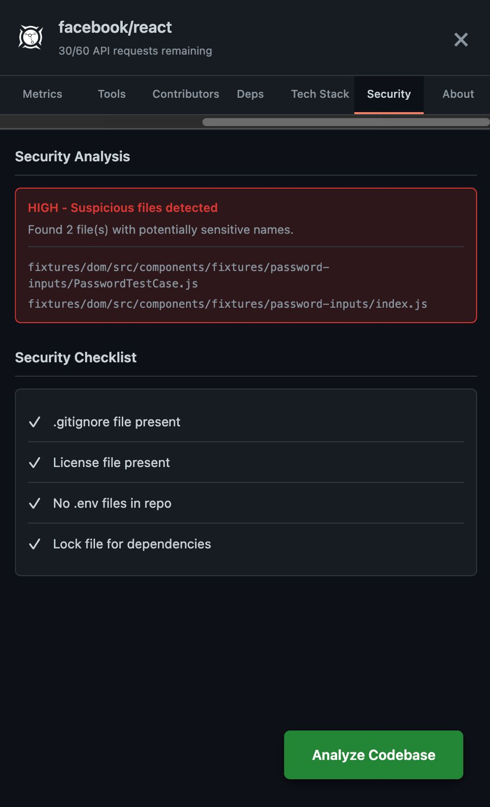

# GitNav - GitHub Repository Navigator

> Powerful GitHub repository analysis and visualization Chrome extension

[](https://chrome.google.com/webstore)
[](https://opensource.org/licenses/MIT)

Navigate any GitHub repository with **interactive visualizations**, **dependency analysis**, and **smart insights** - all without leaving your browser.



## Features

### Interactive Visualization
- Force-directed graph showing repository structure
- Drag nodes, zoom, and explore file relationships
- Color-coded files by type



### Smart Analysis
- **Instant Search** - Find any file in milliseconds
- **Dependency Detection** - Supports npm, Python, Flutter, Rust, Go, Java
- **Security Scanning** - Identify potential vulnerabilities
- **Code Metrics** - Complexity scores and health ratings

### Repository Insights
- Health score calculation (0-100)
- Contributor statistics  
- Commit activity visualization
- Technology stack auto-detection



### Code Metrics
- Estimated lines of code
- Average file sizes
- Complexity scoring
- Commit activity charts



### Private Repository Support
- Securely analyze your private repos
- GitHub tokens stored locally (never sent to external servers)
- No data collection or tracking

### Export & Share
- Export analysis as JSON or Markdown
- One-click clone commands
- Direct file links

## Installation

### From Chrome Web Store (Coming Soon)
1. Visit [GitNav on Chrome Web Store](#)
2. Click "Add to Chrome"
3. Navigate to any GitHub repository
4. Click "Analyze Codebase"

### Install from Source
```bash
# Clone repository
git clone https://github.com/SELESTER11/GitNav.git
cd GitNav

# Install dependencies
npm install

# Build extension
npm run build

# Load in Chrome
# 1. Open chrome://extensions/
# 2. Enable "Developer mode"
# 3. Click "Load unpacked"
# 4. Select the dist/ folder
```

## Usage

### Basic Usage
1. Navigate to any GitHub repository
2. Click the **"Analyze Codebase"** button (bottom right)
3. Explore tabs:
   - **Overview** - Repository stats and quick insights
   - **Visualize** - Interactive force-directed graph
   - **Tree** - File structure explorer
   - **Search** - Find files instantly
   - **Insights** - Health scores and metrics
   - **Metrics** - Code complexity and activity
   - **Dependencies** - Project dependencies
   - **Security** - Vulnerability scanning
   - **About** - Extension information

### Private Repositories
1. Click "Analyze Codebase" on a private repo
2. See the blue banner prompting for a token
3. Click "Create token" - generates GitHub token with `repo` scope
4. Paste token and click "Save"
5. Extension automatically reloads with access

### Tips & Tricks
- **Scroll to zoom** on the force graph
- **Drag nodes** to rearrange visualization
- **Click files** to open on GitHub
- **Click folders** to zoom into that section
- Use **Search tab** for large repos (1000+ files)
- **Export analysis** to save reports

## Screenshots

<table>
  <tr>
    <td><br/><b>Overview</b></td>
    <td><br/><b>Visualization</b></td>
  </tr>
  <tr>
    <td><br/><b>Insights</b></td>
    <td><br/><b>Metrics</b></td>
  </tr>
  <tr>
    <td><br/><b>Tree Explorer</b></td>
    <td><br/><b>Security</b></td>
  </tr>
</table>

## Built With

- **React** - UI components for popup
- **Vanilla JavaScript** - Core extension logic
- **GitHub REST API** - Real-time repository data
- **Canvas API** - High-performance force graph rendering
- **Vite** - Build tooling
- **Chrome Extension Manifest V3** - Latest Chrome extension platform

## Architecture
```
GitNav/
├── src/
│   ├── content.js      # Main extension logic
│   ├── background.js   # Service worker
│   ├── popup.js        # Popup UI (React)
│   └── popup.css       # Popup styles
├── public/
│   └── index.html      # Popup HTML
├── icons/              # Extension icons
├── screenshots/        # Documentation screenshots
├── manifest.json       # Extension manifest
└── vite.config.js      # Build configuration
```

## Contributing

Contributions are welcome! Here's how you can help:

1. **Fork** the repository
2. **Create** a feature branch
```bash
   git checkout -b feature/AmazingFeature
```
3. **Commit** your changes
```bash
   git commit -m 'Add some AmazingFeature'
```
4. **Push** to the branch
```bash
   git push origin feature/AmazingFeature
```
5. **Open** a Pull Request

### Ideas for Contribution
- Add support for more languages (C++, C#, Ruby, PHP)
- Improve force graph performance for very large repos
- Add dark/light theme toggle
- Create video tutorials
- Translate to other languages
- Add more visualization types

## License

This project is licensed under the MIT License - see the [LICENSE](LICENSE) file for details.

## Privacy

GitNav respects your privacy:
- All data processed **locally** in your browser
- GitHub tokens stored in **Chrome local storage only**
- **No analytics** or tracking
- **No external servers** - direct API calls to GitHub only
- **Open source** - audit the code yourself

See [PRIVACY.md](PRIVACY.md) for full details.

## Author

**Varun Karamchandani**
- Computer Science Student at Binghamton University
- GitHub: [github.com/SELESTER11](https://github.com/SELESTER11)
- LinkedIn: [linkedin.com/in/varunkkc](https://linkedin.com/in/varunkkc)
- Email: [vkaramchanda@binghamton.edu](mailto:vkaramchanda@binghamton.edu)

## Acknowledgments

- Inspired by D3.js force-directed graphs
- Built with the GitHub REST API
- Thanks to the open source community

## Project Stats


---

<p align="center">Made with care by Varun Karamchandani</p>
<p align="center">Star this repo if you find it helpful!</p>